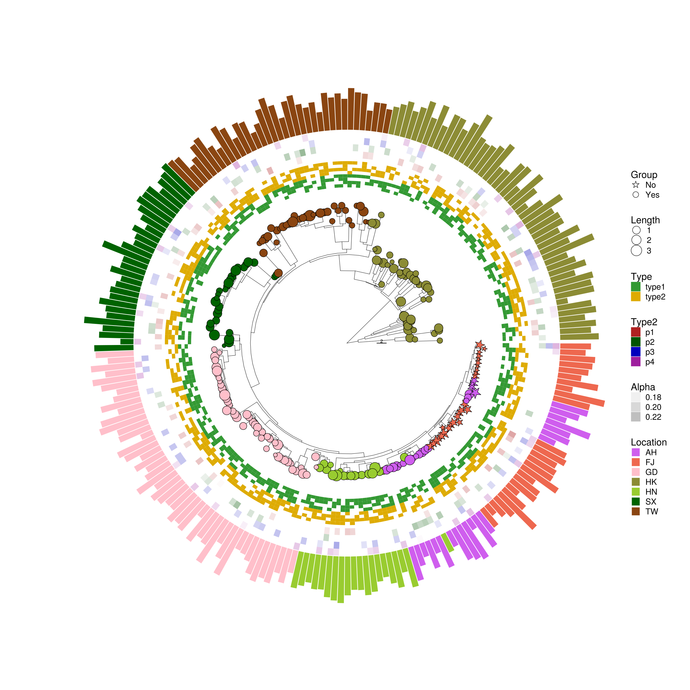

<!-- README.md is generated from README.Rmd. Please edit that file -->

# ggtreeExtra: An R Package To Add Geom Layers On Circular Or Other Layout Tree Of "ggtree".

```{r, echo=FALSE, results="hide", message=FALSE}
library(badger)
```

```{r, comment="", echo=FALSE, results='asis'}
cat(packageDescription('ggtreeExtra')$Description)
```

# :writing_hand: Author

[Shuangbin Xu](https://github.com/xiangpin) and [GuangChuang Yu](https://guangchuangyu.github.io)

School of Basic Medical Sciences, Southern Medical University.

If you use `ggtreeExtra` in published research. Please cite the paper:

__S Xu__, Z Dai, P Guo, X Fu, S Liu, L Zhou, W Tang, T Feng, M Chen, L Zhan, T Wu, E Hu and __G Yu__<sup>\*</sup>. ggtreeExtra: Compact visualization of richly annotated phylogenetic data. __*Research Square*__ doi: [10.21203/rs.3.rs-155672/v2](https://doi.org/10.21203/rs.3.rs-155672/v2).
   - [Source code to produce Supplementary Material](https://github.com/YuLab-SMU/plotting-tree-with-data-using-ggtreeExtra)

<!--

2. __G Yu__, DK Smith, H Zhu, Y Guan, TTY Lam^\*^. ggtree: an R package for visualization and annotation of phylogenetic trees with their covariates and
   other associated data. __*Methods in Ecology and Evolution*__. 2017, 8(1):28-36.
   doi: [10.1111/2041-210X.12628](https://doi.org/10.1111/2041-210X.12628).

1. __G Yu__. Using ggtree to visualize data on tree-like structures. __*Current Protocols in Bioinformatics*__, 2020, 69:e96. doi: [10.1002/cpbi.96](https://doi.org/10.1002/cpbi.96).
   - [Source code and data to reproduce figures in the article](https://github.com/GuangchuangYu/ggtree-current-protocols)
2. __G Yu__^\*^, TTY Lam, H Zhu, Y Guan^\*^. Two methods for mapping and visualizing associated data on phylogeny using ggtree. __*Molecular Biology and Evolution*__, 2018, 35(2):3041-3043. 
   doi: [10.1093/molbev/msy194](https://doi.org/10.1093/molbev/msy194).
   - [Source code to produce Supplementary Material](https://github.com/GuangchuangYu/plotting_tree_with_data)
3. __G Yu__, DK Smith, H Zhu, Y Guan, TTY Lam^\*^. ggtree: an R package for visualization and annotation of phylogenetic trees with their covariates and 
   other associated data. __*Methods in Ecology and Evolution*__. 2017, 8(1):28-36. 
   doi: [10.1111/2041-210X.12628](https://doi.org/10.1111/2041-210X.12628).

-->

# :arrow_double_down: Installation

The development version from `github`:

```r
if (!requireNamespace("devtools", quietly=TRUE))
    install.packages("devtools")
devtools::install_github("xiangpin/ggtreeExtra")
```

The released version from [`Bioconductor`](https://bioconductor.org/packages/ggtreeExtra):

```r
if (!requireNamespace("BiocManager", quietly=TRUE))
    install.packages("BiocManager")

## BiocManager::install("BiocUpgrade") ## you may need this
BiocManager::install("ggtreeExtra")
```

# :beginner: Usage

Please refer to the [online vignette](https://bioconductor.org/packages/devel/bioc/vignettes/ggtreeExtra/inst/doc/ggtreeExtra.html).

```{r, eval=FALSE, echo=FALSE}
library(ggtreeExtra)
library(ggtree)
library(ggplot2)
library(treeio)
library(ggnewscale)
library(ggstar)

trfile <- system.file("extdata", "tree.nwk", package="ggtreeExtra")
tippoint1 <- system.file("extdata", "tree_tippoint_bar.csv", package="ggtreeExtra")
ring1 <- system.file("extdata", "first_ring_discrete.csv", package="ggtreeExtra")
ring2 <- system.file("extdata", "second_ring_continuous.csv", package="ggtreeExtra")
ringpoint <- system.file("extdata", "second_ring_point.csv", package="ggtreeExtra")

tr <- read.tree(trfile)
dat1 <- read.csv(tippoint1)
dat2 <- read.csv(ring1)
dat3 <- read.csv(ring2)

p <- ggtree(tr, layout="fan", size=0.1, open.angle=10) + 
    geom_treescale(x=6, y=0, linesize=0.2, fontsize=1.2)

p1 <- p %<+% dat1 + 
          geom_star(mapping=aes(fill=Location, size=Length, starshape=Group),
                    starstroke=0.2) +
          scale_size_continuous(range=c(1, 3),
                                guide=guide_legend(keywidth=0.5, keyheight=0.5, override.aes=list(starshape=15), order=2)) +
          scale_fill_manual(values=c("#D15FEE","#EE6A50","#FFC0CB","#8E8E38","#9ACD32","#006400","#8B4513"),
                            guide="none")+
          scale_starshape_manual(values=c(1, 15),
                                 guide=guide_legend(keywidth=0.5, keyheight=0.5, order=1),
                                 na.translate=FALSE)

p2 <- p1 +new_scale_fill()+ 
          geom_fruit(data=dat2,
                      geom=geom_tile,
                      mapping=aes(y=ID, x=Pos, fill=Type),
                      offset=0.08,
                      pwidth=0.25) +
          scale_fill_manual(values=c("#339933", "#dfac03"),
                            guide=guide_legend(keywidth=0.5, keyheight=0.5, order=3)) +
          geom_axis_text(angle=-45, hjust=0)

p3 <- p2 + new_scale_fill()+
           geom_fruit(data=dat3,
                       geom=geom_tile,
                       mapping=aes(y=ID, x=Type2, alpha=Alpha, fill=Type2),
                       pwidth=0.15)+
          scale_fill_manual(values=c("#b22222", "#005500", "#0000be", "#9f1f9f"),
                            guide=guide_legend(keywidth=0.5, keyheight=0.5, order=4)) +
          scale_alpha_continuous(range=c(0, 0.4),
                                guide=guide_legend(keywidth=0.5, keyheight=0.5, order=5)) +
          geom_axis_text(angle=-45, hjust=0)

p4 <- p3 + new_scale_fill()+
           geom_fruit(data=dat1,
                       geom=geom_bar,
                       mapping=aes(y=ID, x=Abundance, fill=Location),
                       pwidth=0.4,
                       stat="identity",
                       orientation="y")+
           geom_axis_text(angle=-45, hjust=0) +
           scale_fill_manual(values=c("#D15FEE","#EE6A50","#FFC0CB","#8E8E38","#9ACD32","#006400","#8B4513"),
                             guide=guide_legend(keywidth=0.5, keyheight=0.5, order=6)) +
           theme(legend.position=c(0.96, 0.5),
                 legend.background=element_rect(fill=NA),
                 legend.title=element_text(size=7),
                 legend.text=element_text(size=6),
                 legend.spacing.y = unit(0.02, "cm"))
p4
```

<!--  -->

# :sparkling_heart: Contributing

We welcome any contributions! By participating in this project you agree to abide
by the terms outlined in the [Contributor Code of Conduct](CONDUCT.md).
